# Frise chronologique : Schattenjagers et allies

> **Source de verite pour les passations** : `registre-sixieme-diamant.md`. Une date absente est notee `inconnue` et ne doit pas etre inventee.

```mermaid
flowchart LR
    subgraph S["Schattenjagers et porteuses - gauche"]
        direction TB
        HAT["Hatchepsout\n~1507 - ~1458 av. J.-C.\nPassation : ~1458 av. J.-C."]
        DEB["Deborah\nNaissance/deces inconnus\nPassation : inconnue"]
        SAP["Sappho\n~630 - ~570 av. J.-C.\nPassation : inconnue"]
        ASP["Aspasie\n~470 - apres 429 av. J.-C.\nPassation : apres 429 av. J.-C."]
        LIV["Livie Drusilla\n58 av. J.-C. - 29 apr. J.-C.\nPassation : 14 apr. J.-C."]
        BEL["Belisama\nDates inconnues\nPassation : milieu du Ier s."]
        PRI["Priscille\nDates inconnues\nPassation : apres 57"]
        HEL["Helene\n~248/250 - 329/330\nPassation : 327-330"]
        GAL["Galla Placidia\n~388/392 - 450\nPassation : 450"]
        BRI["Brigitte de Kildare\n451 - 525 (tradition)\nPassation : 525"]
        THE["Theodora\n~497/500 - 548\nPassation : 548"]
        HIL["Hilda de Whitby\n614 - 680\nPassation : 680"]
        IRE["Irene l'Athenienne\n~752 - 803\nPassation : 793"]
        ALC["Alcuin d'York\n~735 - 804\nPassation : 804"]
        MAR["Marozia\n~890 - apres 932\nPassation : 932"]
        HRO["Hrotsvita\nDates inconnues, active 960-980\nPassation : 978"]
        BRU["Brunhilde\nDates inconnues\nPassation : vers 980"]
        LUB["Lubna de Cordoue\nDates inconnues\nPassation : 1002"]
        HDE["Hildegarde de Bingen\n1098 - 1179\nPassation : 1179, a Alma"]
        ALM["Alma\nDates inconnues\nPassation : inconnue"]
        MEC["Mechthilde de Magdebourg\n~1207 - ~1282\nPassation : 1278, aux Ritter"]
        HAT --> DEB --> SAP --> ASP --> LIV --> BEL --> PRI --> HEL --> GAL --> BRI --> THE --> HIL --> IRE --> ALC --> MAR --> HRO --> BRU --> LUB --> HDE --> ALM --> MEC
    end

    subgraph A["Allies, archanges et gardiens - droite"]
        direction TB
        GEO["Georges\nFin IIIe/debut IVe s. (tradition)\nAllie non porteur"]
        WU["Wu Zetian\n624 - 705\nAlliee non porteuse"]
        FAT["Fatima al-Fihri\nDates inconnues, fondation traditionnelle : 859\nAlliee non porteuse"]
        AVI["Avicenne\n980 - 1037\nArchange en 2036, diamant #4"]
        OTT["Otto de Bamberg\n~1060 - 1139\nFondateur des Ritter : 1122"]
        ANN["Anna Comnene\n1083 - ~1153\nAlliee non porteuse"]
        TOM["Tomoe Gozen\nDates inconnues, active dans la tradition : 1180-1185\nAlliee non porteuse"]
        DIE["Dietrich Ritter\nDates inconnues, mort : 1280\nDepositaire non porteur : 1278-1280"]
        GEO --> WU --> FAT --> AVI --> OTT --> ANN --> TOM --> DIE
    end
```

## Schattenjagers et porteuses du sixieme diamant

| Porteuse | Naissance | Deces | Passation du cristal |
|---|---|---|---|
| Hatchepsout | ~1507 av. J.-C. | ~1458 av. J.-C. | ~1458 av. J.-C., a une pretresse d'Hathor |
| Deborah | Inconnue | Inconnue | Inconnue |
| Sappho | ~630 av. J.-C. | ~570 av. J.-C. | Inconnue |
| Aspasie | ~470 av. J.-C. | Apres 429 av. J.-C. | Apres 429 av. J.-C., a une depositaire anonyme |
| Livie Drusilla | 58 av. J.-C. | 29 apr. J.-C. | 14 apr. J.-C., vers Massalia |
| Belisama | Inconnue | Inconnue | Milieu du Ier siecle apr. J.-C., a une depositaire italienne |
| Priscille | Inconnue | Inconnue | Apres 57, hors d'Italie |
| Helene | ~248/250 | 329/330 | 327-330, hors de la cour |
| Galla Placidia | ~388/392 | 450 | 450, a une depositaire anonyme |
| Brigitte de Kildare | 451 (tradition) | 525 (tradition) | 525, vers une depositaire northumbrienne |
| Theodora | ~497/500 | 548 | 548, hors de la cour |
| Hilda de Whitby | 614 | 680 | 680, hors de Whitby |
| Irene l'Athenienne | ~752 | 803 | 793, a une messagere northumbrienne |
| Alcuin d'York | ~735 | 804 | 804, a Tours, vers une depositaire anonyme |
| Marozia | ~890 | Apres 932 | 932, a une depositaire romaine |
| Hrotsvita de Gandersheim | Inconnue | Inconnue | 978, a Brunhilde |
| Brunhilde | Inconnue | Vers 980 | Vers 980, a une depositaire anonyme |
| Lubna de Cordoue | Inconnue | Inconnue | 1002, vers un relais anonyme au nord |
| Hildegarde de Bingen | 1098 | 1179 | 1179, a Alma |
| Alma | Inconnue | Inconnue | Inconnue, relais vers Mechthilde a preciser |
| Mechthilde de Magdebourg | ~1207 | ~1282 | 1278, aux Gardiens Ritter de Rittersberg |

## Allies, archanges et gardiens

| Allie | Naissance | Deces | Statut ou jalon |
|---|---|---|---|
| Georges | Inconnue | Inconnue | Martyr de tradition, fin IIIe/debut IVe siecle ; allie non porteur |
| Wu Zetian | 624 | 705 | Alliee humaine non porteuse |
| Fatima al-Fihri | Inconnue | Inconnue | Fondation traditionnelle d'al-Qarawiyyin : 859 |
| Avicenne | 980 | 1037 | Elu archange en 2036 ; recoit le quatrieme diamant bleu |
| Otto de Bamberg | ~1060 | 1139 | Fonde les Ritter en 1122 |
| Anna Comnene | 1083 | ~1153 | Alliee humaine de la memoire |
| Tomoe Gozen | Inconnue | Inconnue | Guerriere de tradition, active dans le recit de Genpei (1180-1185) |
| Dietrich Ritter | Inconnue | 1280 | Premier depositaire nomme de la garde collective (1278-1280) |

## Garde actuelle du sixieme diamant

Depuis 1280, le sixieme diamant est sous la garde des Ritter a Rittersberg, avant une transmission future non fixee. Gabriel Knight demeure le dernier heritier connu a l'epoque contemporaine ; ses dates de vie et son lien materiel exact avec le diamant restent a documenter.