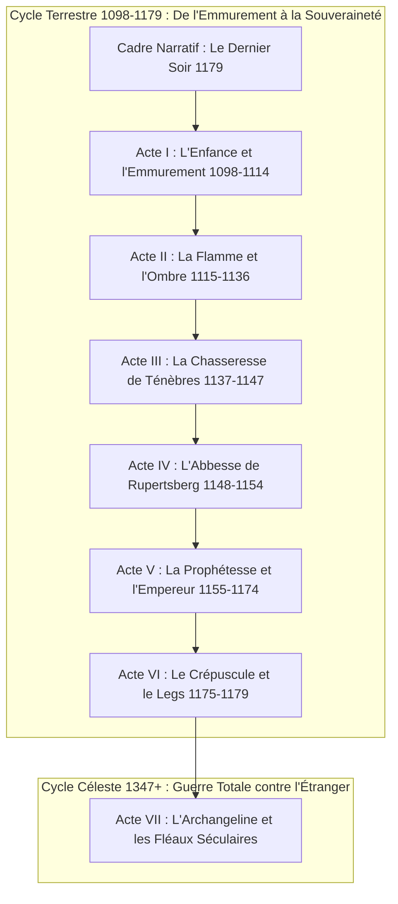
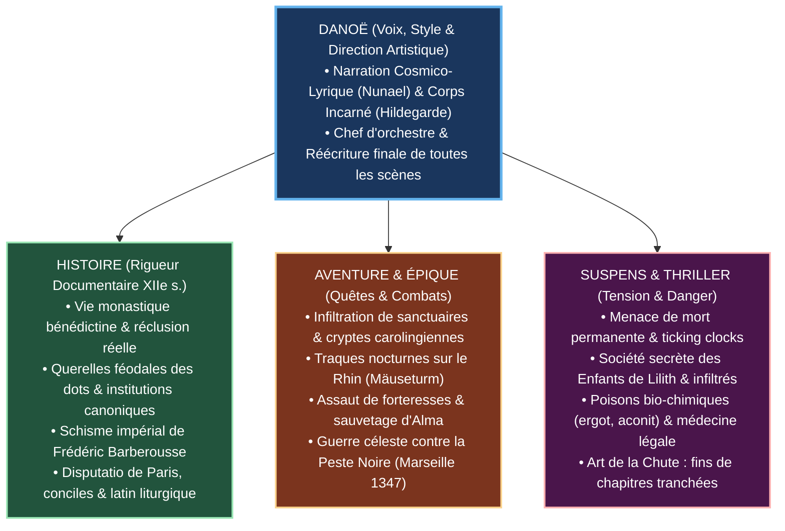

# TOME 2 — HILDEGARDE : LA LUMIÈRE VIVANTE ET LE SANG DU RHIN
*Fresque Épique, Enquête Ésotérique et Thriller Géopolitique du XIIe Siècle*



---

## 🏛️ TRIPTYQUE CRÉATIF : L'ÉQUILIBRE DES FORCES



---

## CADRE NARRATIF D'OUVERTURE

### [[Chapitre-01|Chapitre 1 — Le Dernier Soir]]
*L'ultime veillée : quand la cire d'une vie s'éteint sous la griffe du Malin.*
- **Période & Cadre** : Nuit du 16 septembre 1179 — Scriptorium d'angle, Abbaye de Rupertsberg (Bingen).
- **POV & Voix** : Hildegarde (81 ans, voix rauque, viscérale, corps martyrisé mais esprit d'acier).
- **Pilier Historique** : Rupertsberg sort à peine de l'Interdit ecclésiastique imposé par Mayence ; tensions encore vives avec le clergé local ; veillée monastique authentique.
- **Moteur d'Aventure & Suspens** : 
  - *Ticking Clock* : Hildegarde sent que ses poumons ne passeront pas l'aube. Elle doit crypter et léguer l'ultime codex des *Schattenjägers*.
  - *Menace immédiate* : Un moine étranger, porteur d'une dague triangulaire et d'une fiole d'aconit, a franchi la poterne basse sous l'orage.
- **Value Shift** : Agonie vulnérable $\longrightarrow$ Alerte de guerre et passation clandestine.
- **Les 5 Phases** :
  - *Hook & Setup* : La flamme de la chandelle vacille dans un courant d'air suspect. Odeur d'encre de galle mêlée au souffle d'ozone de la Nahe en crue.
  - *Trigger & Wrangle* : Le diamant bleu collé à ses os pulse avec frénésie. « Pourquoi ce battement maintenant ? L'Ombre est dans nos murs. »
  - *Action & Midpoint* : Hildegarde convoque la jeune novice Alma, lui fait jurer le silence par le sang et sort du double fond de l'armoire le parchemin scellé d'Hatchepsout.
  - *Crisis* : Une silhouette passe devant les vitraux du cloître. On tente de forcer la serrure de chêne du scriptorium.
  - *Résolution & Chute* : Hildegarde glisse la clef de fer dans la manche d'Alma et arme son stylet d'argent.
- **Art de la Chute** : *« La cire coule sur mes doigts noueux. Le temps n'attend plus. »*

---

## ACTE I — L'ENFANCE ET L'EMMUREMENT (1098–1114)
*Arc initiatique : Du ventre maternel aux ténèbres du tombeau vivant.*
*Thème : L'éveil de la Connaissance dans la nuit d'une société féodale violente.*

```
Value Shift de l'Acte I : Enfant maudite et infirme ───► Initiation sacrée / Maîtrise de la Lux Vivens
```

### [[Chapitre-02|Chapitre 2 — La Naissance du Cristal]]
- **Période & Cadre** : 16 septembre 1098 — Manoir fortifié de Bermersheim vor der Höhe (Palatinat).
- **POV & Voix** : Nunael (Prologue cosmique) $\rightarrow$ Hildebert von Bermersheim (père féodal).
- **Pilier Historique** : Contexte de la Première Croisade (1096-1099) ; militarisation de la noblesse rhénane ; coutume de la dîme du dixième enfant voué à Dieu.
- **Moteur d'Aventure & Suspens** :
  - *Élément Fantastique* : La brèche temporelle de la *Chambre des Possibles* dépose le sixième diamant bleu dans la main du nouveau-né.
  - *Suspense* : Un chanoine cupide venu réclamer la dîme féodale tente de s'emparer de la gemme miraculeuse ; le père doit menacer de son épée pour protéger le berceau.
- **Value Shift** : Fardeau familial $\longrightarrow$ Élection mystique armée.
- **Art de la Chute** : *« Dixième enfant. La dîme due au ciel. »*

### [[Chapitre-03|Chapitre 3 — L'Enfant qui Voit]]
- **Période & Cadre** : 1101–1106 (Hildegarde de 3 à 8 ans) — Terres de Bermersheim.
- **POV & Voix** : Hildegarde (enfance sensorielle, perméable aux auras).
- **Pilier Historique** : Superstitions médiévales entourant les enfants malades et les « possédés » ; méthodes archaïques des rebouteux.
- **Moteur d'Aventure & Suspens** :
  - *Mystère & Angoisse* : Hildegarde décrit les fils invisibles reliant les plantes et les hommes (*Viriditas*), mais perçoit aussi les vrilles noires d'une bête spectrale qui rôde dans les bois voisins (la *Wilde Jagd*).
  - *Climax de scène* : Elle prédit avec exactitude la mort soudaine d'un étalon de guerre et les taches du poulain dans le ventre de la jument. Le village hurle à la sorcellerie.
- **Value Shift** : Innocence terrorisée $\longrightarrow$ Prise de conscience de la fracture avec les siens.
- **Art de la Chute** : *« Ils crurent à un délire de fièvre. J'avais seulement vu la trame du monde. »*

### [[Chapitre-04|Chapitre 4 — L'Emmurement]]
- **Période & Cadre** : 1er novembre 1106 (Fête de la Toussaint) — Abbaye bénédictine de Disibodenberg.
- **POV & Voix** : Hildegarde (8 ans).
- **Pilier Historique** : Le rituel canonique de la réclusion totale (*inclusio*) sous l'autorité de l'évêque de Spire ; vœux de Jutta von Sponheim.
- **Moteur d'Aventure & Suspens** :
  - *Ambiance Claustrophobique & Horreur* : L'office des morts chanté en plein jour ; le bruit sourd de la truelle scellant les moellons de grès.
  - *Épreuve* : Dans le noir absolu de la cellule, des murmures hostiles grattent la pierre extérieure. Le diamant bleu au cou de la fillette s'illumine pour la première fois, formant un dôme d'or qui repousse les entités.
- **Value Shift** : Mort civile absolue $\longrightarrow$ Sanctuaire imprenable de l'âme.
- **Art de la Chute** : *« On chanta pour nos âmes défuntes. J'étais enterrée vive. »*

### [[Chapitre-05|Chapitre 5 — Le Manuscrit du Dragon]]
- **Période & Cadre** : ~1110–1112 — Cellule et scriptorium de Disibodenberg.
- **POV & Voix** : Hildegarde (12-14 ans).
- **Pilier Historique** : Apprentissage du latin biblique, chant grégorien, enluminure médiévale sous la tutelle austère de Jutta.
- **Moteur d'Aventure & Suspens** :
  - *Quête d'Artefact* : Hildegarde découvre dans la double doublure d'un coffre paternel un parchemin grec orné d'un Ouroboros, relatant le mythe originel de **La Curieuse** (Tome 1) et l'avertissement contre l'Étranger.
  - *Révélation Fondatrice* : Le texte révèle le grand dessein de l'Ombre : éteindre l'autorité spirituelle et médicale des femmes pour abandonner les hommes à la folie de la guerre et précipiter la chute du monde.
  - *Tension dramatique* : Jutta, fanatisée par des pénitences morbides, surprend Hildegarde et tente de brûler le manuscrit au nom de la foi ; Hildegarde sauve les feuillets à mains nues des flammes.
- **Value Shift** : Soumission monacale $\longrightarrow$ Révolte intellectuelle et conscience de la mission féminine.
- **Art de la Chute** : *« Mon père ne servait pas que l'Empereur. Il chassait la nuit. »*

### [[Chapitre-06|Chapitre 6 — La Première Vision de la Lumière Vivante]]
- **Période & Cadre** : ~1112 — Disibodenberg sous un déluge d'automne.
- **POV & Voix** : Hildegarde (14 ans).
- **Pilier Historique** : Première grande théophanie documentée dans la biographie officielle d'Hildegarde.
- **Moteur d'Aventure & Suspens** :
  - *Choc Mystique & Danger Mortel* : Une migraine cataclysmique foudroie Hildegarde ; la *Lux Vivens* descend du ciel comme une lance incandescente.
  - *Bataille Psychique* : Nunael lui apparaît et ouvre son esprit aux structures du cosmos, tandis qu'une gueule d'ombre (l'Étranger) tente de consumer son cœur d'adolescente. Le cristal agit comme un bouclier réflecteur.
- **Value Shift** : Fragilité corporelle $\longrightarrow$ Consécration prophétique indélébile.
- **Art de la Chute** : *« Je ne brûlais pas. J'étais devenue le foyer. »*

---

## ACTE II — LA FLAMME ET L'OMBRE (1115–1136)
*Arc tragique : L'unique amour brisé, la calomnie sacrilège et la manipulation de l'Étranger.*
*Thème : Le prix du sang face à la jalousie humaine instrumentalisée par l'Ombre.*

```
Value Shift de l'Acte II : Éveil amoureux pur ───► Martyre de Richard / Lucidité sur le piège de l'Étranger
```

### [[Chapitre-07|Chapitre 7 — Richard]]
- **Période & Cadre** : ~1115–1118 — Scriptorium et parloir de Disibodenberg.
- **POV & Voix** : Hildegarde & Richard (perspectives croisées).
- **Pilier Historique** : Facture instrumentale médiévale (psaltérions, cithares, flûtes en roseau) et émergence de la composition monodique et polyphonique en Rhénanie.
- **La Rencontre Musicale** :
  - *Filiation & Vocation* : Richard est le fils d'un fabricant d'instruments réputé et le propre neveu de Jutta von Sponheim (le père de Richard est le frère de Jutta). Compositeur passionné à ses heures perdues, il est envoyé par Jutta pour enseigner la musique à Hildegarde, dont elle a décelé les talents hors du commun.
  - *Fascination Mutuelle* : Richard est immédiatement envoûté par la voix de cristal d'Hildegarde, son oreille absolue et son intuition géniale qui transcende les modes grégoriens rigides.
  - *Trouble Naissant* : Au fil des leçons hebdomadaires, le partage des harmonies se teinte d'une attirance ambiguë, pure et magnétique : la naissance de leur unique amour.
- **Value Shift** : Solitude carcérale $\longrightarrow$ Éveil d'une complicité amoureuse et spirituelle lumineuse.
- **Art de la Chute** : *« Les cordes vibraient encore. Nos âmes s'étaient touchées. »*

### [[Chapitre-08|Chapitre 8 — La Calomnie]]
- **Période & Cadre** : ~1119–1120 — Cellule et cloître de Disibodenberg.
- **POV & Voix** : Hildegarde & la sœur accusatrice.
- **Pilier Historique** : Clôture monastique stricte, promiscuité des couvents médiévaux et paranoïa autour de la pureté rituelle des recluses.
- **Moteur d'Aventure & Suspens** :
  - *Les Regards Épiés* : Plusieurs sœurs remarquent les silences vibrants et les regards troublés échangés durant les leçons de musique et vont s'en plaindre à Jutta.
  - *Le Mensonge de la Jalousie* : L'une des moniales, rongée par l'envie devant l'aura et le génie d'Hildegarde, invente de toutes pièces une accusation infamante d'attouchements sacrilèges.
  - *Arrestation & Torture* : Les prévôts de l'abbé arrêtent brutalement Richard à son atelier. Jeté dans les cachots humides sous Disibodenberg, le jeune homme est roué de coups et battu jusqu'au sang par les gardes pour lui arracher des aveux de souillure qu'il refuse de prononcer.
- **Value Shift** : Harmonie secrète $\longrightarrow$ Déchaînement de la violence cléricale et calomnie.
- **Art de la Chute** : *« La jalousie avait parlé. Le fer avait répondu. »*

### [[Chapitre-09|Chapitre 9 — Le Supplice et le Témoignage]]
- **Période & Cadre** : ~1120 — Parvis public de Disibodenberg.
- **POV & Voix** : Hildegarde & Jutta von Sponheim.
- **Pilier Historique** : Justice ecclésiastique sommaire ; peines infamantes sur la place publique ; statut juridique du témoignage des matrones et sages-femmes médiévales.
- **Moteur d'Aventure & Suspens** :
  - *Condamnation à Mort* : Traîné en haillons sanglants devant la foule des moines et des villageois, Richard est déclaré coupable de viol sur une consacrée de Dieu et condamné à la flagellation jusqu'à ce que mort s'ensuive.
  - *Le Sang et le Courage de Jutta* : Alors que les lanières de cuir plombé lacèrent le dos de Richard attaché au poteau, Jutta fend la foule au péril de son rang. Elle exige qu'une matrone respectée du public examine Hildegarde sur-le-champ pour prouver que sa vertu est inviolée, et réclame la libération immédiate de son neveu si sa virginité est attestée.
  - *L'Épreuve Publique* : L'examen médical est réalisé sous les voiles tendus par les femmes du bourg. La matrone atteste publiquement et solennellement devant l'abbé que la virginité d'Hildegarde est intacte.
  - *Délivrance Tragique* : L'abbé est forcé d'interrompre le supplice. Richard est détaché, le corps broyé et pantelant.
- **Value Shift** : Mort publique infamante $\longrightarrow$ Innocence reconnue au prix d'un corps supplicié.
- **Art de la Chute** : *« La foule baissait les yeux. La chair était déchirée pour toujours. »*

### [[Chapitre-10|Chapitre 10 — Le Deuil et l'Empreinte de l'Ombre]]
- **Période & Cadre** : ~1121 — Cellule d'Hildegarde et maison du facteur d'instruments.
- **POV & Voix** : Hildegarde & Nunael (Voix cosmique).
- **Pilier Historique** : Médecine d'urgence médiévale impuissante face aux fièvres d'infection et aux traumatismes internes ; deuil monastique.
- **Révélation Cosmique & Drame Intime** :
  - *L'Agonie de Richard* : Malgré les soins et les baumes d'Hildegarde, Richard ne se remet pas de ses blessures internes et de la fièvre ; il s'éteint quelques semaines plus tard. Hildegarde gardera toute son existence la cicatrice amère et indélébile de son unique amour.
  - *La Compréhension de Nunael* : À travers la résonance du sixième diamant bleu, Nunael analyse l'engrenage : elle comprend que la jalousie aveugle de la sœur accusatrice a été soufflée et nourrie par les murmures de l'Étranger, dont le plan était de briser psychologiquement Hildegarde et d'étouffer sa *Viriditas* dans le désespoir.
  - *Le Serment de Résistance* : Hildegarde refuse de se laisser anéantir : sa douleur se transmue en une volonté d'acier de consacrer son art et sa musique à la vérité.
- **Value Shift** : Abattement du deuil $\longrightarrow$ Découverte de la machination de l'Étranger et vœu de combat.
- **Art de la Chute** : *« Mon seul amour était mort. L'Ombre venait de signer son crime. »*

### [[Chapitre-11|Chapitre 11 — Le Complot]]
- **Période & Cadre** : ~1123–1125 — Souterrains et bibliothèques secrètes de Disibodenberg.
- **POV & Voix** : Konrad von Ravensburg & Hildegarde.
- **Pilier Historique** : Réseaux de simonie (vente des sacrements et charges) gangrénant le haut clergé rhénan.
- **Moteur d'Aventure & Suspens** :
  - *Espionnage & Chiffrement* : Décryptage des missives des barons de Mayence finançant la secte pour éliminer les réformatrices.
  - *Combat Rapproché* : Embuscade d'un faux moine assassin dans la crypte ; Konrad l'élimine en duel singulier sur les reliques.
- **Value Shift** : Isolement vulnérable $\longrightarrow$ Organisation d'une cellule de contre-espionnage.
- **Art de la Chute** : *« Les loups portaient la coule. »*

### [[Chapitre-12|Chapitre 12 — Scivias : L'Ordre contre le Chaos]]
- **Période & Cadre** : ~1126–1135 — Cellule d'écriture, Disibodenberg.
- **POV & Voix** : Hildegarde & Volmar (secrétaire et frère d'armes).
- **Pilier Historique** : Rédaction des 26 visions monumentales du *Scivias* ; technique médiévale de l'enluminure aux pigments précieux (lapis-lazuli, or pur).
- **Moteur d'Aventure & Suspens** :
  - *Guerre Mystique & Attaques Nocturnes* : Chaque vision dictée par Nunael déclenche des assauts psychiques de l'Étranger (visions de pestilence, moisissure toxique sur le vélin).
  - *Codage Clandestin* : Hildegarde intègre dans les images de l'Œuf Cosmique la carte des repaires de la secte le long du Rhin.
- **Value Shift** : Folie présumée $\longrightarrow$ Érection d'un chef-d'œuvre de résistance intellectuelle.
- **Art de la Chute** : *« Écris ce que tu vois et entends. Pas un mot de moins. »*

### [[Chapitre-13|Chapitre 13 — La Mort de Jutta]]
- **Période & Cadre** : 1136 — Cellule de Disibodenberg.
- **POV & Voix** : Hildegarde.
- **Pilier Historique** : Décès de Jutta von Sponheim après trente ans de jeûnes extrêmes ; élection capitulaire démocratique de la nouvelle *Magistra*.
- **Moteur d'Aventure & Suspens** :
  - *Révélation Testamentaire* : Sur son lit d'agonie, Jutta révèle qu'elle a passé sa vie à protéger Hildegarde d'un tueur infiltré et lui transmet l'anneau de fer des bâtisseuses saxonnes.
  - *Bataille Électorale* : L'abbé Kuno tente d'annuler le vote des nonnes. Les sœurs se soulèvent et proclament Hildegarde maîtresse des lieux.
- **Value Shift** : Prisonnière sous tutelle $\longrightarrow$ Dirigeante souveraine de la communauté.
- **Art de la Chute** : *« La geôlière s'éteignait. La maîtresse des lieux se levait. »*

---

## ACTE III — LA CHASSEUSE DE TÉNÈBRES (1137–1147)
*Arc d'investigation & de combat : Le Synode de Trèves, la bibliothèque de Cologne et la guerre ouverte.*
*Thème : L'affirmation politique et militaire de la lignée des Schattenjägers.*

```
Value Shift de l'Acte III : Résistance clandestine ───► Légitimité papale / Fondation des Schattenjägers
```

### [[Chapitre-14|Chapitre 14 — Le Symbole de Lilith]]
- **Période & Cadre** : ~1137–1138 — Disibodenberg.
- **POV & Voix** : Hildegarde & Guillaume de Conches.
- **Pilier Historique** : L'essor de l'École de Chartres, le platonisme médiéval et l'arrivée de la philosophie naturelle arabe en Occident.
- **Moteur d'Aventure & Suspens** :
  - *Arrivée de l'Érudit Fugitif* : Guillaume de Conches débarque blessé, pourchassé par des mercenaires, porteur d'un papyrus sauvé de Cordoue.
  - *Révélation Épique sur l'Étranger* : Guillaume et Hildegarde décryptent l'Histoire depuis la Curieuse : chaque effacement de reine, de savante ou de guérisseuse (Hatchepsout, Hypatie, Lubna) a permis à des tyrans masculins d'embraser l'Histoire. L'Étranger veut faire du XIIe siècle le tombeau de la sagesse féminine.
- **Value Shift** : Conflit rhénan local $\longrightarrow$ Prise de conscience de la guerre des mondes et du combat contre l'annihilation de l'humanité.
- **Art de la Chute** : *« Ils ne veulent pas seulement nos corps. Ils veulent effacer notre nom pour que les hommes brûlent le monde. »*

### [[Chapitre-15|Chapitre 15 — L'Infiltration]]
- **Période & Cadre** : ~1138–1139 — Forteresse déchue du Palatinat et repaire troglodyte.
- **POV & Voix** : Konrad von Ravensburg & Sœur Frida (espionne d'Hildegarde).
- **Pilier Historique** : Les ordres de chevalerie naissants, mercenariat et brigandage féodal sous le règne troublé de Conrad III.
- **Moteur d'Aventure & Suspens** :
  - *Mission d'Infiltration à Haut Risque* : Frida et Konrad infiltrent un banquet rituel des Enfants de Lilith où sont vendues des fioles de poison foudroyant.
  - *Fuite Épique* : Reconnus, ils doivent combattre à un contre cinq dans les écuries enflammées avant de s'échapper à cheval sous les tirs d'arbalète.
- **Value Shift** : Aveuglement stratégique $\longrightarrow$ Capture des plans de l'ennemi.
- **Art de la Chute** : *« L'or de l'Empire achetait le silence des tombes. »*

### [[Chapitre-16|Chapitre 16 — Le Sermon de Trèves]]
- **Période & Cadre** : Hiver 1147–1148 — Synode papal de Trèves.
- **POV & Voix** : Bernard de Clairvaux & le pape Eugène III.
- **Pilier Historique** : Le pape Eugène III examine officiellement les visions d'Hildegarde lors du concile de Trèves sur insistance de saint Bernard.
- **Moteur d'Aventure & Suspens** :
  - *Disputatio Dramatique* : Les prélats réactionnaires accusent Hildegarde d'être une sorcière manipulée par Satan pour égarer la Chrétienté.
  - *Miracle & Bascule* : Le pape lit à haute voix un extrait du *Scivias*. Les vitraux de la cathédrale de Trèves résonnent d'une harmonique pure ; Bernard de Clairvaux s'agenouille, vaincu par la majesté du Verbe.
- **Value Shift** : Menace du bûcher $\longrightarrow$ Triomphe apostolique mondial.
- **Art de la Chute** : *« Rome avait parlé. La prophétesse était intouchable. »*

### [[Chapitre-17|Chapitre 17 — L'Abbesse Réformatrice]]
- **Période & Cadre** : Printemps 1148 — Disibodenberg.
- **POV & Voix** : Hildegarde.
- **Pilier Historique** : Révolution liturgique d'Hildegarde : libération des corps féminins, robes de soie, cheveux détachés et chants novateurs.
- **Moteur d'Aventure & Suspens** :
  - *Affrontement Direct avec l'Abbé Kuno* : Les moines tentent de bloquer les portes de l'église pour empêcher la liturgie réformée.
  - *Démonstration de Force Mystique* : Hildegarde entonne son grand hymne à la *Viriditas* ; les vibrations font vaciller les candélabres de fer et brisent la résistance des moines.
- **Value Shift** : Soumission aux coutumes patriarcales $\longrightarrow$ Révolution esthétique et spirituelle.
- **Art de la Chute** : *« Chanter, c'est prier deux fois. C'est surtout combattre. »*

### [[Chapitre-18|Chapitre 18 — La Bibliothèque de Cologne]]
- **Période & Cadre** : ~1143–1145 — Port fluvial et scriptorium capitulaire de Cologne.
- **POV & Voix** : Guillaume de Conches & Hildegarde.
- **Pilier Historique** : Le quartier juif et marchand de Cologne, carrefour des manuscrits entre l'Orient, l'Italie et le Nord de l'Europe.
- **Moteur d'Aventure & Suspens** :
  - *Expédition Urbaine Clandestine* : Guidés par un rabbin kabbaliste, ils pénètrent dans une cave voûtée abritant les reliques de la reine guerrière Tomyris et de la philosophe Hypatie.
  - *Attaque Terroriste* : Des assassins masqués mettent le feu au scriptorium avec du poix grégeois. Hildegarde sauve les parchemins en plongeant dans la cave inondée.
- **Value Shift** : Ignorance des origines $\longrightarrow$ Récupération des archives sacrées de la lignée.
- **Art de la Chute** : *« Je n'étais pas le début. J'étais l'écho d'un millénaire. »*

### [[Chapitre-19|Chapitre 19 — La Tour aux Souris]]
- **Période & Cadre** : ~1145 — Donjon insulaire de la Mäuseturm, au milieu des rapides du Rhin (Bingen).
- **POV & Voix** : Hildegarde & Konrad von Ravensburg.
- **Pilier Historique** : Légende rhénane de l'archevêque Hatto ; point névralgique du péage fluvial du Rhin au XIIe siècle.
- **Moteur d'Aventure & Suspens** :
  - *Excursion Nocturne Périlleuse* : Traversée du fleuve en barque sous des tourbillons mortels.
  - *Chasse aux Monstres* : Le donjon est le repaire d'une entité engendrée par les sacrifices rituels de l'archevêque félon. Hildegarde et Konrad livrent une bataille d'exorcisme et de fer au sommet de la tour battue par les vents.
- **Value Shift** : Territoire sous emprise démoniaque $\longrightarrow$ Nœud tellurique purifié.
- **Art de la Chute** : *« Le fleuve charriait des ombres qui ne se noyaient jamais. »*

### [[Chapitre-20|Chapitre 20 — La Crypte de Disibodenberg]]
- **Période & Cadre** : ~1146 — Fondations carolingiennes sous Disibodenberg.
- **POV & Voix** : Guillaume de Conches, Konrad & Hildegarde.
- **Pilier Historique** : Traces archéologiques des sanctuaires romains de Mithra enfouis sous les monastères chrétiens médiévaux.
- **Moteur d'Aventure & Suspens** :
  - *Bataille Souterraine Désespérée* : Embuscade tendue par les maîtres de la secte de Lilith au cœur des catacombes.
  - *Sacrifice Héroïque* : Guillaume de Conches est mortellement blessé en s'interposant devant Hildegarde ; avant d'expirer, il trace sur le sol avec son sang le plan d'une abbaye fortifiée sur le mont Rupertsberg.
- **Value Shift** : Recherche érudite $\longrightarrow$ Tragédie fondatrice sanglante.
- **Art de la Chute** : *« Guillaume tomba sur les dalles. Le savoir se payait de sang. »*

### [[Chapitre-21|Chapitre 21 — Le Serment des Schattenjägers]]
- **Période & Cadre** : Nuit de la Saint-Jean ~1147 — Chapelle haute de Disibodenberg.
- **POV & Voix** : Hildegarde & Nunael (Voix cosmique).
- **Pilier Historique** : Fondation informelle de réseaux de protection du savoir en marge des structures féodales.
- **Moteur d'Aventure & Suspens** :
  - *Théophanie Suprême* : Descente de Nunael dans un faisceau de lumière zénithale.
  - *Investiture Armée* : Hildegarde et Konrad posent la main sur le sixième diamant bleu et sur la garde de l'épée brisée de Guillaume pour prononcer le Serment éternel des *Chasseurs d'Ombres*.
- **Value Shift** : Deuil paralysant $\longrightarrow$ Naissance officielle de la confrérie des Schattenjägers.
- **Art de la Chute** : *« Chasseresse d'ombres. Désormais et pour l'éternité. »*

---

## ACTE IV — L'ABBESSE DE RUPERTSBERG (1148–1154)
*Arc de bâtisseuse : La fondation de la cité du savoir, le complot médical et le choc avec l'Empire.*
*Thème : L'autonomie matérielle, politique et corporelle des femmes.*

```
Value Shift de l'Acte IV : Tutelle abusive ───► Indépendance matérielle souveraine & Fondation de Rupertsberg
```

### [[Chapitre-22|Chapitre 22 — Les Guerres de l'Âme (Ordo Virtutum)]]
- **Période & Cadre** : ~1148–1151 — Rupertsberg en chantier.
- **POV & Voix** : Hildegarde & Richardis von Stade (sa fille spirituelle).
- **Pilier Historique** : Création du premier drame liturgique moralisé de l'Occident médiéval ([[Ordo Virtutum]]) ; rôle des nobles moniales mécènes.
- **Moteur d'Aventure & Suspens** :
  - *Rituel d'Exorcisme Musical* : La représentation théâtrale secrète sert de piège pour identifier les faux novices infiltrés par la secte.
  - *Déchirement Intime* : L'archevêque de Brême ordonne le départ forcé de Richardis pour en faire son abbesse fantoche ; Hildegarde tente tout pour contrer cet exil manipulé par l'Ombre.
- **Value Shift** : Création artistique isolée $\longrightarrow$ Arme théurgique collective.
- **Art de la Chute** : *« Le Malin ne connaît pas la musique. Il n'a que des cris. »*

### [[Chapitre-23|Chapitre 23 — La Joute de Mayence]]
- **Période & Cadre** : ~1149–1151 — Grand Palais archiépiscopal de Mayence.
- **POV & Voix** : Hildegarde face au conclave des théologiens.
- **Pilier Historique** : Débats scolastiques du XIIe siècle sur la place de la femme dans l'exégèse biblique ; statut juridique des biens monastiques féminins.
- **Moteur d'Aventure & Suspens** :
  - *Duel Oratoire à Haut Risque* : Les chanoines accusent Hildegarde d'usurpation du sacerdoce masculin et veulent confisquer les richesses de Rupertsberg.
  - *Victoire Rhétorique Foudroyante* : Hildegarde utilise l'héritage d'Aspasie et retourne les arguments de saint Paul contre les prélats corrompus, sous les vivats du peuple rassemblé sur le parvis.
- **Value Shift** : Vulnérabilité juridique $\longrightarrow$ Triomphe politique écrasant.
- **Art de la Chute** : *« Leurs syllogismes s'effondrèrent sous le poids de la grâce. »*

### [[Chapitre-24|Chapitre 24 — L'Empoisonnement et les Traités de Vie]]
- **Période & Cadre** : ~1150–1151 — Laboratoire de simples et infirmerie de Rupertsberg.
- **POV & Voix** : Hildegarde (médecin et chimiste) & Nunael (perspective cosmique).
- **Pilier Historique** : Rédaction des traités scientifiques majeurs [[Physica]] et [[Causae et Curae]] ; description avant-gardiste de l'asepsie, de l'ébullition des eaux et de la pharmacopée des simples.
- **Le Grand Coup d'Échiquier de Nunael** :
  - *L'Angle Mort de l'Étranger* : Alors que l'Étranger mobilise ses espions contre l'influence politique d'Hildegarde, Nunael guide secrètement la plume de l'abbesse pour consigner chaque remède, chaque dosage et chaque principe d'hygiène.
  - *L'Arme des Siècles* : Ces écrits ne sont pas seulement destinés aux contemporains : ils constituent l'antidote préparé deux siècles en avance contre la Peste Noire de 1347.
- **Moteur d'Aventure & Suspens** :
  - *Course contre la Mort* : Une novice s'effondre après avoir communié ; Hildegarde identifie un mélange létal d'ergot de seigle et de ciguë noire.
  - *Enquête Pharmacologique* : Hildegarde fabrique l'antidote à la goutte près tout en traquant la servante complice à travers les caves du monastère.
- **Value Shift** : Panique médicale $\longrightarrow$ Victoire de la science expérimentale et sacralisation des herbiers.
- **Art de la Chute** : *« La plante guérit ce que la haine empoisonne. Écrire n'était plus soigner : c'était armer les siècles. »*

### [[Chapitre-25|Chapitre 25 — Le Lit de Mort de Conrad III]]
- **Période & Cadre** : Février 1152 — Palais impérial de Bamberg.
- **POV & Voix** : Hugo von Bermersheim (frère et confesseur impérial) & Hildegarde.
- **Pilier Historique** : Fin de la dynastie des Hohenstaufen sous Conrad III ; accession foudroyante de Frédéric Ier Barberousse au trône d'Allemagne.
- **Moteur d'Aventure & Suspens** :
  - *Conspiration au Sommet de l'Empire* : Hugo appelle Hildegarde en secret auprès de l'empereur agonisant pour contrer une tentative d'empoisonnement d'État.
  - *Face-à-Face avec Barberousse* : Hildegarde croise pour la première fois le regard d'acier du jeune duc Frédéric et perçoit l'Aigle Noir dévorateur d'âmes qui plane sur son destin.
- **Value Shift** : Secret de famille $\longrightarrow$ Entrée fracassante dans la haute politique impériale.
- **Art de la Chute** : *« La couronne change de tête. L'abîme reste béant. »*

### [[Chapitre-26|Chapitre 26 — Le Sanctuaire sur le Rhin]]
- **Période & Cadre** : ~1150–1152 — Colline rocheuse et sauvage de Rupertsberg.
- **POV & Voix** : Hildegarde.
- **Pilier Historique** : Refus farouche de l'abbé de Disibodenberg de libérer les moniales ; paralysie somatique documentée d'Hildegarde.
- **Moteur d'Aventure & Suspens** :
  - *Épreuve Somatique & Mystique* : Hildegarde tombe raide comme du marbre (activation involontaire de la *Patience de la Pierre* d'Hatchepsout). Nul médecin ne peut la mouvoir.
  - *Chantage Divin* : L'archevêque de Mayence, effrayé par ce prodige public, force Kuno à signer la charte d'émancipation. À la seconde où le sceau de cire est apposé, Hildegarde se redresse indemne.
- **Value Shift** : Impuissance corporelle $\longrightarrow$ Victoire matérielle absolue.
- **Art de la Chute** : *« Mon corps brisé avait vaincu leur avarice. »*

### [[Chapitre-27|Chapitre 27 — L'Inauguration de Rupertsberg]]
- **Période & Cadre** : Mai 1152 — Abbaye de Rupertsberg consacrée.
- **POV & Voix** : Hildegarde & la communauté des vingt moniales.
- **Pilier Historique** : Fêtes de dédicace des grands monastères rhénans ; aménagement de canalisations d'eau courante inédites pour l'époque.
- **Moteur d'Aventure & Suspens** :
  - *Triomphe Lumineux* : Procession des religieuses vêtues de blanc couronnées d'or sous les cloches de fête.
  - *Construction de la Bibliothèque Basse* : Dans la nuit, Konrad et Hildegarde scellent sous l'autel majeur la crypte blindée abritant le registre des Schattenjägers et les flacons d'antidotes.
- **Value Shift** : Sans-abri sous tutelle $\longrightarrow$ Propriétaires d'une citadelle imprenable du savoir.
- **Art de la Chute** : *« Notre maison était debout. La forteresse du savoir. »*

---

## ACTE V — LA PROPHÉTISSE ET L'EMPEREUR (1155–1174)
*Arc géopolitique & guerrier : Prédications publiques à travers l'Europe, schisme d'Occident et sauvetage d'Alma.*
*Thème : La parole de vérité dressée contre la terreur des armées impériales.*

```
Value Shift de l'Acte V : Rayonnement régional ───► Conscience morale de l'Occident & Sauvetage d'Alma
```

### [[Chapitre-28|Chapitre 28 — Le Retour de Lilith]]
- **Période & Cadre** : ~1155–1157 — Rives du Rhin et massif du Taunus.
- **POV & Voix** : Konrad von Ravensburg & Hildegarde.
- **Pilier Historique** : Recrudescence des sectes millénaristes et dissidences hérétiques en Rhénanie.
- **Moteur d'Aventure & Suspens** :
  - *Attaque de Convoi Fluvial* : Les péniches apportant le blé et les parchemins à Rupertsberg sont coulées au milieu des flammes par des brigands mercenaires.
  - *Message de Mort* : Une tête de loup clouée sur la porterie avec un parchemin menaçant de brûler vives toutes les pensionnaires de Rupertsberg.
- **Value Shift** : Paix des cloîtres $\longrightarrow$ État de siège et riposte tactique.
- **Art de la Chute** : *« L'Ombre sortait enfin à découvert. »*

### [[Chapitre-29|Chapitre 29 — Le Sanctuaire d'Alma]]
- **Période & Cadre** : ~1157–1158 — Forteresse troglodytique du Hunsrück.
- **POV & Voix** : Konrad von Ravensburg & Hildegarde.
- **Pilier Historique** : Sièges et destructions des châteaux de barons-pillards ordonnés par les diètes provinciales.
- **Moteur d'Aventure & Suspens** :
  - *Assaut Commando Nocturne* : Konrad et ses chevaliers mènent un raid spectaculaire pour détruire le laboratoire d'alchimie noire de Margreth von Ravensburg.
  - *Sauvetage Clé de la Saga* : Au milieu de l'incendie de la tour maîtresse, Hildegarde sauve des décombres la petite orpheline **Alma** (5 ans), dont les mains brillent de la même lueur azurée que le sixième diamant.
- **Value Shift** : Destruction punitive $\longrightarrow$ Sauvetage providentiel de la future dépositaire.
- **Art de la Chute** : *« Dans les décombres fumants, une enfant pleurait. Mon héritière. »*

### [[Chapitre-30|Chapitre 30 — La Traversée vers Paris]]
- **Période & Cadre** : ~1160 — Routes d'Alsace, de Lorraine et de Champagne.
- **POV & Voix** : Hildegarde, Katherine, Konrad.
- **Pilier Historique** : Les quatre grandes tournées de prédication publique d'Hildegarde (Metz, Trèves, Cologne, Liège) — fait unique dans l'histoire médiévale pour une femme.
- **Moteur d'Aventure & Suspens** :
  - *Périls de la Route Féodale* : Embuscade de coupe-jarrets déjouée par la lance de Konrad ; accueil triomphal par les foules paysannes réclamant des guérisons.
  - *Course contre l'Épuisement* : Hildegarde prêche debout sur les estrades des places publiques, haranguant les clercs corrompus malgré ses crises de faiblesse cardiaque.
- **Value Shift** : Reclusion monacale $\longrightarrow$ Voix publique prophétique continentale.
- **Art de la Chute** : *« Chaque lieue gagnée était une victoire sur la mort. »*

### [[Chapitre-31|Chapitre 31 — La Disputatio de Paris]]
- **Période & Cadre** : ~1160 — Chantier des fondations de Notre-Dame de Paris & Salle capitulaire.
- **POV & Voix** : Hildegarde & l'évêque Maurice de Sully.
- **Pilier Historique** : Élection de Maurice de Sully (1160) et lancement du chantier de la cathédrale Notre-Dame ; effervescence des universités parisiennes naissantes.
- **Moteur d'Aventure & Suspens** :
  - *Joute Théologique et Ésotérique* : Hildegarde affronte les docteurs parisiens sceptiques et remet à Maurice de Sully les tracés régulateurs issus de la *Bibliothèque Éternelle* de Nunael pour capter la lumière zénithale dans la future nef.
  - *Complot Déjoué* : Une tentative d'incendier les plans de la cathédrale est déjouée par les acolytes de Konrad.
- **Value Shift** : Méfiance académique $\longrightarrow$ Empreinte architecturale sacrée millénaire.
- **Art de la Chute** : *« Les pierres de cette église défieront les siècles. »*

### [[Chapitre-32|Chapitre 32 — La Diète de Roncaglia]]
- **Période & Cadre** : ~1158–1162 — Camp impérial de Roncaglia (Lombardie) / Rupertsberg.
- **POV & Voix** : Frédéric Barberousse & Hildegarde (par ses lettres foudroyantes).
- **Pilier Historique** : Diète de Roncaglia imposant le droit régalien absolu de l'Empereur ; schisme d'Occident avec l'élection d'antipapes sous la botte impériale.
- **Moteur d'Aventure & Suspens** :
  - *Choc des Volontés* : Barberousse menace de faire raser Rupertsberg si Hildegarde soutient le pape Alexandre III.
  - *Lettre de Terreur Sacrée* : Hildegarde envoie une missive prophétique foudroyante qui fait trembler l'Empereur en plein conseil de guerre : « Tu es un insensé, ô Roi ! Si tu ne plies pas, l'Épée du Très-Haut fendra ta dynastie. » Barberousse recule.
- **Value Shift** : Terreur militaire $\longrightarrow$ Triomphe de la rectitude morale sur la force brute.
- **Art de la Chute** : *« L'épée de l'Empereur plia devant la voix de la recluse. »*

### [[Chapitre-33|Chapitre 33 — Le Traité de Venise]]
- **Période & Cadre** : Juillet 1177 — Basilique Saint-Marc et lagune de Venise.
- **POV & Voix** : Le pape Alexandre III & Hildegarde (en communion télépathique).
- **Pilier Historique** : Paix historique de Venise réconciliant Barberousse et Alexandre III après deux décennies de guerre fratricide.
- **Moteur d'Aventure & Suspens** :
  - *Diplomatie Clandestine* : Les courriers secrets d'Hildegarde dictent les clauses théologiques du compromis de paix.
  - *Attentat Déjoué à Saint-Marc* : Un séide de la lune noire tente d'assassiner le pape lors de la génuflexion impériale ; le coup est paré in extremis par les chevaliers de Konrad.
- **Value Shift** : Schisme continental sanglant $\longrightarrow$ Rétablissement de la concorde chrétienne.
- **Art de la Chute** : *« L'Empire et l'Église s'agenouillaient. La paix avait un prix. »*

---

## ACTE VI — LE CRÉPUSCULE ET LE LEGS (1175–1179)
*Arc de résistance finale : L'Interdit de Mayence, la transmission du Sixième Diamant et le trépas glorieux.*
*Thème : L'invincibilité de la conscience pure face à la mort et à la censure.*

```
Value Shift de l'Acte VI : Mort imminente ───► Transmission à Alma accomplie & Apothéose lumineuse
```

### [[Chapitre-34|Chapitre 34 — La Transmission]]
- **Période & Cadre** : ~1178 — Bibliothèque Basse de Rupertsberg.
- **POV & Voix** : Hildegarde (80 ans) & Alma (25 ans, novice érudite et médecin).
- **Pilier Historique** : Rédaction des dernières correspondances et achèvement du codex de la [[Lingua Ignota]] (langue sacrée inventée de 23 lettres).
- **Moteur d'Aventure & Suspens** :
  - *Cérémonie Clandestine d'Initiation* : Hildegarde transmet à Alma la formule cryptographique permettant d'activer la résonance du diamant bleu.
  - *Alerte Nocturne* : Des patrouilles armées envoyées par le chapitre de Mayence encerclent l'abbaye pour saisir les archives secrètes ; Alma réussit à cacher les codex dans les fûts de vin de la cave basse.
- **Value Shift** : Angoisse de la rupture $\longrightarrow$ Chaîne de transmission sécurisée pour le XIIIe siècle.
- **Art de la Chute** : *« Prends ce feu, Alma. Ne le laisse jamais s'éteindre. »*

### [[Chapitre-35|Chapitre 35 — L'Interdit de Mayence]]
- **Période & Cadre** : 1178–1179 — Cimetière et cloître de Rupertsberg.
- **POV & Voix** : Hildegarde face aux vicaires de Mayence.
- **Pilier Historique** : Crise de l'Interdit ecclésiastique : Hildegarde refuse d'exhumer le corps d'un jeune noble réconcilié avant sa mort ; interdiction absolue de chanter les offices.
- **Moteur d'Aventure & Suspens** :
  - *Affrontement Physique & Moral* : Les émissaires armés arrivent avec des pelles pour déterrer le cadavre. Hildegarde, appuyée sur sa crosse d'abbesse, frappe le sol, trace une croix et efface les limites de la tombe pour la rendre introuvable.
  - *Ultimatum Poétique* : Privée de messe, elle écrit son immortel traité sur la musique : réduire au silence les chants sacrés, c'est capituler devant Satan. Mayence est contrainte de lever l'interdit.
- **Value Shift** : Oppression cléricale maximale $\longrightarrow$ Victoire héroïque de la dignité humaine.
- **Art de la Chute** : *« Vous pouvez faire taire nos voix. Vous ne ferez pas taire Dieu. »*

### [[Chapitre-36|Chapitre 36 — Le Dernier Souffle]]
- **Période & Cadre** : Nuit du 16 au 17 septembre 1179 (aube) — Cellule de Rupertsberg.
- **POV & Voix** : Hildegarde & Nunael (fusion des deux consciences).
- **Pilier Historique** : Mort d'Hildegarde à l'âge de 81 ans ; chroniques médiévales attestant de deux arcs-en-ciel lumineux étincelant au-dessus de sa cellule à l'heure du décès.
- **Moteur d'Aventure & Suspens** :
  - *Passage de Flambeau dans le Sang* : Le moine assassin du Ch. 1 tente une ultime intrusion dans la chambre d'agonie ; Konrad l'abat sur le seuil.
  - *Délivrance Glorieuse* : Hildegarde détache le sixième diamant bleu de son cou et le referme dans la main d'Alma. Nunael fend le voile dimensionnel et recueille son âme libérée.
- **Value Shift** : Fin terrestre mortelle $\longrightarrow$ Transcendance et naissance dans l'éternité céleste.
- **Art de la Chute** : *« Le corps n'était plus rien. Le voyage commençait. »*

---

## ACTE VII — L'ARCHANGELINE ET LES FLÉAUX SÉCULAIRES (POST-MORTEM & ÉTERNITÉ : 1347+)
*Arc cosmique : Du Jardin de Nunael aux batailles pour sauver l'humanité à travers les siècles.*
*Thème : La sainte devenue archange combattant les armes biologiques et spirituelles de l'Étranger.*

```
Value Shift de l'Acte VII : Âme désincarnée ───► 7e Archange / Fondation perpétuelle des Schattenjägers
```

### [[Chapitre-37|Chapitre 37 — Le Tunnel des Miroirs]]
- **Période & Cadre** : Hors du temps — Corridor dimensionnel du Tunnel.
- **POV & Voix** : Hildegarde (conscience astrale pure).
- **Moteur d'Aventure & Suspens** :
  - *Épreuve Initiatique des Miroirs* : Hildegarde revit chaque douleur et chaque gloire terrestre.
  - *Piège de l'Étranger* : Un Doppelgänger tente de la piéger dans l'illusion d'une vie heureuse avec Richard pour l'empêcher d'atteindre le Jardin. Hildegarde pulvérise le mirage par la force de sa volonté.
- **Value Shift** : Attachement terrestre $\longrightarrow$ Purifiée pour le combat éternel.
- **Art de la Chute** : *« Chaque larme versée devenait une constellation. »*

### [[Chapitre-38|Chapitre 38 — Le Jardin de Nunael]]
- **Période & Cadre** : [[Le-Jardin|Le Jardin Primordial]] (Paradis de clarté dorée).
- **POV & Voix** : Hildegarde & Nunael.
- **Moteur d'Aventure & Suspens** :
  - *Exploration Épique* : Découverte des merveilles de la *Bibliothèque Éternelle*, du Planétarium de l'*Astrolabe* et du *Campus des Savoirs*.
  - *Révélation de la Menace Cosmique* : Nunael lui montre le Trou Noir central qui dévore les étoiles aux frontières du Jardin : la guerre contre l'Étranger fait rage.
- **Value Shift** : Repos contemplatif $\longrightarrow$ Réengagement volontaire dans la guerre cosmique.
- **Art de la Chute** : *« Tout ce que j'avais entrevu n'était que l'ombre de ce royaume. »*

### [[Chapitre-39|Chapitre 39 — Les Ailes Vertes]]
- **Période & Cadre** : Nef de la Métamorphose, Cité des Arts.
- **POV & Voix** : Hildegarde.
- **Moteur d'Aventure & Suspens** :
  - *Transfiguration Angélique* : Intégration dans l'Ordre des **Thaumaturges** (gardiens du soin et de la *Viriditas*).
  - *Baptême de Lumière* : Émergence d'ailes de pure énergie vert émeraude et or ; conservation intégrale de sa mémoire terrestre et de son tempérament de fer.
- **Value Shift** : Âme sauvée $\longrightarrow$ Guerrière-guérisseuse céleste investie.
- **Art de la Chute** : *« Je ne marchais plus. Je rayonnais. »*

### [[Chapitre-40|Chapitre 40 — Le Dispensaire des Âmes]]
- **Période & Cadre** : [[Le-Refuge|Le Refuge des Âmes]].
- **POV & Voix** : Hildegarde (Gardienne du Refuge).
- **Moteur d'Aventure & Suspens** :
  - *Médecine Céleste en Urgence* : Soins intensifs apportés aux milliers d'âmes brûlées par les bûchers de l'Inquisition terrestre du XIIIe siècle.
  - *Incursion d'Espions de l'Ombre* : Infiltration de créatures ténébreuses tentant de corrompre les fontaines de jouvence célestes ; Hildegarde les purge par ses compositions harmoniques.
- **Value Shift** : Gestion de routine $\longrightarrow$ Forteresse hospitalière inviolable.
- **Art de la Chute** : *« Guérir les âmes était plus vaste que guérir les corps. »*

### [[Chapitre-41|Chapitre 41 — L'Élection de 1347]]
- **Période & Cadre** : 1347 — Tribunal du Jardin et Conseil des Cinq Archanges (Hypatie, Ada, Tomyris, Avicenne, Léonard).
- **POV & Voix** : Nunael & Conseil des Archanges.
- **Le Piège Dévoilé** :
  - *L'Offensive Biologique de l'Étranger* : L'Étranger déclenche le bacille de la Peste Noire au siège de Caffa (Crimée) pour anéantir l'humanité. Il croit sa victoire totale.
  - *Le Déploiement de l'Antidote d'Hildegarde* : Nunael révèle aux Archanges que les traités de médecine rédigés par Hildegarde au XIIe siècle ont été copiés et dispersés dans tout le réseau des *Schattenjägers*.
- **Moteur d'Aventure & Suspens** :
  - *Vote Historique* : Les 50 anges élisent à l'unanimité Hildegarde comme **7e Archange**, investie du cristal archange de guérison pour orchestrer la riposte sur Terre.
  - *Investiture Armée* : Nunael confie le sceptre émeraude à Hildegarde : « Va sauver ceux que tes écrits attendent déjà. »
- **Value Shift** : Gardienne passive $\longrightarrow$ Investiture du Septième Glaive de la Création.
- **Art de la Chute** : *« La Terre agonise. Tu es notre glaive de miséricorde. »*

### [[Chapitre-42|Chapitre 42 — La Peste et les Ombres]]
- **Période & Cadre** : Novembre 1347 — Port et lazarets de Marseille.
- **POV & Voix** : Hildegarde incarnée sous les traits de « Sœur Margarethe ».
- **Pilier Historique** : Arrivée des galères génoises pestiférées à Marseille ; panique collective, fuite des autorités et effondrement sanitaire de 1347-1348.
- **Moteur d'Aventure & Triomphe Stratégique** :
  - *Application Pratique du Physica* : Sœur Margarethe applique les protocoles d'isolement, de désinfection par le vinaigre et de décoctions de plantes qu'elle a rédigés deux siècles plus tôt à Rupertsberg.
  - *Bataille Occulte sur les Quais* : Affrontement sanglant contre une légion de démons astraux de l'Étranger qui découvrent avec fureur que les lignes de défense médicales humaines tiennent bon grâce aux codex d'Hildegarde.
- **Value Shift** : Triomphe du désespoir $\longrightarrow$ Foyer de survie et victoire éclatante du savoir médical.
- **Art de la Chute** : *« Dans les miasmes noirs, l'émeraude ne s'éteignit point. Le piège de l'encre s'était refermé sur l'Ombre. »*

### [[Chapitre-43|Chapitre 43 — Les Fléaux à Travers les Âges]]
- **Période & Cadre** : Fresque séculaire (1453 Chute de Constantinople, 1666 Grand Incendie de Londres, 1793 Terreur à Paris, 1918 Tranchées de Verdun, 1944 Camp de Ravensbrück).
- **POV & Voix** : Hildegarde (L'Archangeline).
- **Pilier Historique** : Moments de bascule et de tragédie suprême de l'Histoire humaine.
- **Moteur d'Aventure & Suspens** :
  - *Missions d'Extraction à Haut Risque* : À chaque siècle, Hildegarde descend sous une forme humaine anonyme pour sauver une dépositaire du diamant, un carnet scientifique ou une résistante ciblée par l'Ombre.
  - *Loi de la Consommation* : Chaque intervention consome une part irréversible de sa lumière divine ; ses ailes s'ébrèchent, mais son sourire reste invincible.
- **Value Shift** : Usure du corps céleste $\longrightarrow$ Victoire inextinguible de la résistance humaine.
- **Art de la Chute** : *« Cinq fois tombée pour les hommes. Cinq fois relevée par l'amour. »*

### [[Chapitre-44|Chapitre 44 — Les Schattenjägers]]
- **Période & Cadre** : Château de Rittersberg (Bavière, époque contemporaine) & Ciel éternel.
- **POV & Voix** : Nunael & Hildegarde (Archangeline protectrice).
- **Moteur d'Aventure & Suspens** :
  - *Climax et Clôture Magistrale* : L'héritier Gabriel Knight contemple le blason aux trois lions dans la crypte bavaroise ; le sixième diamant brille dans son reliquaire séculaire.
  - *Alliance Terre-Ciel Scellée* : Hildegarde et Nunael veillent depuis l'Astrolabe sur la lignée ininterrompue des Chasseurs d'Ombres prêts à affronter l'ultime assaut du Trou Noir.
- **Value Shift** : Quête d'une femme du XIIe siècle $\longrightarrow$ Bouclier planétaire éternel de l'humanité.
- **Art de la Chute finale** : *« Les ombres avancent. Mais les chasseurs veillent. »*

---

## OUVERTURE DU TOME 3 — HATCHEPSOUT (VERS 1473 AV. J.-C.)
*Coda cosmique : avant la première Chasseresse, le désert révèle la guerre qui vient.*

### [[Chapitre-45|Chapitre 45 — La Pierre qui Attend]]
- **Fonction dans la saga** : Chapitre final du Tome 2 et seuil du Tome 3. Le dépôt précède la découverte ; Hatchepsout demeure hors-scène jusqu'à la chute. Le chapitre installe le lieu, la menace et le choix qui l'attend.
- **Période & Cadre** : Vers 1473 av. J.-C. — Chambre des Possibles, puis carrières de granit rose d'Assouan, Égypte de la XVIIIe dynastie.
- **POV & Voix** : Nunael, à la première personne. Elle observe sans infléchir les décisions humaines.
- **Pilier historique** : Après la mort de Thoutmôsis II vers 1479, Hatchepsout exerce la régence auprès de Thoutmôsis III, puis la royauté avec lui. L'adoption de la titulature royale complète se situe généralement vers 1473/1472. L'extraction du granit d'Assouan est attestée ; l'inspection royale, le dépôt du diamant et les antagonismes sont fiction-canonique.
- **Question dramatique** : Le diamant muet rencontrera-t-il une conscience libre avant que des volontés humaines ne rendent cette rencontre impossible ou inutile ?
- **Complot de l'Étranger** : Il ne commande ni cercle ni meurtre. Il rend convergentes des prudences humaines : un scribe soucieux de l'héritier, un responsable cultuel inquiet de ses prérogatives et des administrateurs attachés à une succession lisible préparent des récits, des classements et des justifications rituelles qui pourront, plus tard, faire de la royauté d'Hatchepsout une exception provisoire. L'Étranger attise leur peur d'un pouvoir féminin ; leur responsabilité demeure entière.
- **Value Shift** : Surveillance confiante $\longrightarrow$ Acceptation douloureuse que la liberté humaine porte le prix de son propre avenir.
- **Héritage préparé** : Le diamant demeure à l'état **déposé**, intact, latent et sans porteur. Aucune aptitude, fragilité ou communication n'y est inscrite avant le contact d'Hatchepsout ; ses empreintes se formeront au cours de son règne.
- **Plan détaillé en cinq phases** :
  - *Ouverture — La chambre* : **Objectif** : raccorder la veille céleste de Nunael à une époque encore inconnue. **Conflit** : la Chambre retire le sixième diamant du hors-temps, et Nunael en perçoit le coût de dilution sans pouvoir en garantir l'usage. **Ancrage** : froid bleu de la Chambre, silence de verre autour de la Terre miniature. **Sens** : lumière froide, vibration minérale, goût de cendre sur une essence sans bouche. **Chute** : *« L'Égypte m'appelait. »*
  - *Incitation — La carrière* : **Objectif** : montrer le dépôt du diamant dans un interstice fiction-canonique d'Assouan. **Conflit** : Nunael s'en remet au libre arbitre d'une conscience qu'elle ne connaît pas encore. **Ancrage** : soleil blanc sur le granit, poussière rose, Nil sombre au pied des falaises. **Sens** : éclat aveuglant, rugosité de la roche, odeur chaude de limon, coups sourds des percuteurs de dolérite. **Indice semé** : une veine de pierre fendue comme une paupière close. **Chute** : *« La pierre attendit. »*
  - *Développement — Les voix derrière le voile* : **Objectif** : dévoiler une menace administrative, cultuelle et humaine sans inventer une conjuration centrale. **Conflit** : un scribe de la maison royale veut protéger la place de l'héritier ; un dignitaire isolé craint pour ses prérogatives ; une gardienne choisit la copie secrète plutôt que l'accusation publique. Leurs décisions distinctes préparent des précédents dont d'autres se serviront après la mort d'Hatchepsout. **Ancrage** : abri de scribe près du débarcadère, souffle brûlant, odeur de papyrus chauffé et de résine. **Sens** : grattement du calame, sable entre les dents, cire fondue, chuchotements étouffés. **Climax intermédiaire** : Nunael soupçonne une pression sans source visible, l'Étranger n'ayant rien créé mais ayant rendu chaque prudence plus dure. **Chute** : *« La peur apprenait à écrire. »*
  - *Crise — L'absence qui pèse* : **Objectif** : faire mesurer à Nunael le prix de sa non-intervention. **Conflit** : protéger le dépôt par une action directe détruirait la liberté de celle ou celui qui le découvrira et fragiliserait Nunael ; se taire laisse les choix humains porter leurs conséquences. **Ancrage** : plein midi sur la veine de granit, sans aucune trace surnaturelle visible. **Sens** : chaleur coupante, bourdonnement des insectes soudain tari, poussière métallique sur la langue. **Indice semé** : un ostracon à l'encre rouge et noire, où une titulature demeure volontairement inachevée. **Chute** : *« Je ne pouvais pas choisir à leur place. »*
  - *Résolution — Celle qui vient* : **Objectif** : faire accepter à Nunael que le diamant demeure sans promesse explicite jusqu'à une rencontre libre. **Conflit** : l'espérance de Nunael s'oppose à ce qu'elle devine du coût futur de son retrait. **Ancrage** : à l'horizon, une barque royale approche Assouan, voile d'ocre dans la lumière basse. **Sens** : clapotis lourd, pierre chaude, présence minérale imperceptible aux humains. **Payoff** : Nunael distingue deux victoires possibles, conserver une couronne ou transmettre une méthode de résistance, sans savoir encore laquelle sera choisie. **Art de la Chute finale** : *« Alors Hatchepsout entra dans le désert. »*
- **Continuité canonique à préserver pour le Tome 3** : Thoutmôsis III demeure corégent et n'est pas réduit à un antagoniste ; les motivations des opposants restent humaines, puis amplifiées par l'Étranger ; aucune damnatio memoriae n'est accomplie dans ce chapitre, son déploiement appartient à l'après-mort d'Hatchepsout ; le diamant n'est ni activé ni épuisé avant sa découverte.
- **Appareil documentaire recommandé** : Ajouter à l'annexe historique du Tome 3 une note distinguant les carrières d'Assouan et la chronologie débattue de l'accession d'Hatchepsout au pouvoir des éléments fiction-canonique du complot et du diamant.

---

## 📚 APPAREIL DOCUMENTAIRE DU TOME 2

| Section | Fichier Obsidian | Contenu & Rigueur Scientifique |
|---|---|---|
| **Annexe A** | [[Annexe-Coulisses-Roman\|Les Coulisses du Roman]] | Note d'intention littéraire et féministe de Danoë : réhabiliter la figure d'Hildegarde sans anachronisme artificiel. |
| **Annexe B** | [[Annexe-Genese-Univers\|La Genèse de l'Univers]] | Vulgarisation scientifique : De l'asymétrie matière/antimatière à la collision Théia et l'entropie des mondes. |
| **Annexe C** | [[Annexe-Biographie-Hildegarde\|Hildegarde de Bingen (1098-1179)]] | Analyse rigoureuse des sources médiévales (*Vita Sanctae Hildegardis*, *Scivias*, *Physica*, correspondance pontificale). |
| **Annexe D** | [[Annexe-Notes-Critiques\|Notes de Bas de Page & Sources]] | Appareil critique médiéval : institutions canoniques rhénanes, botanique du XIIe siècle, hérésies et schismes. |
