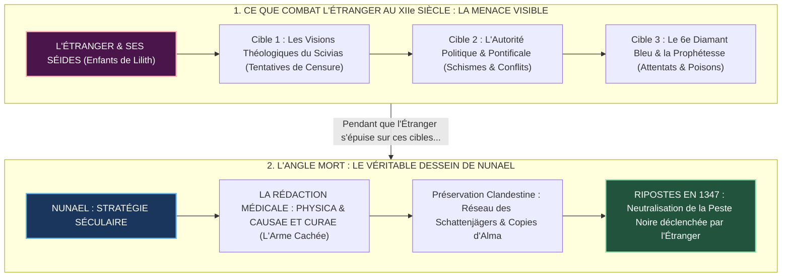
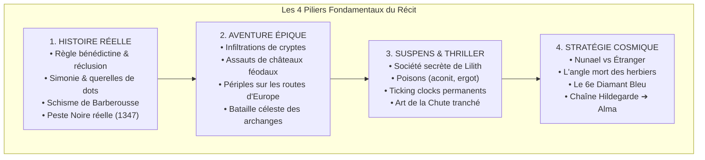
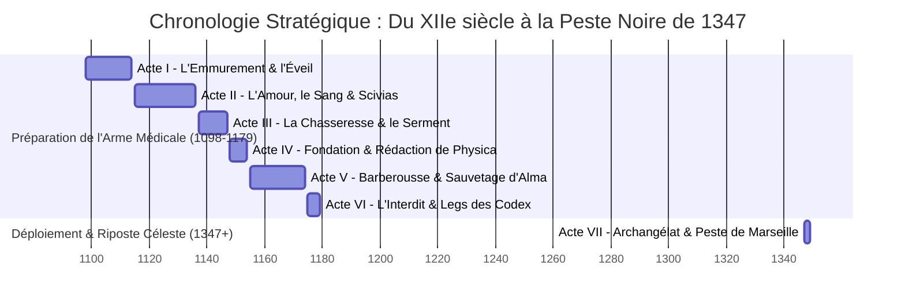

# ARCHITECTURE NARRATIVE DU TOME 2 : HILDEGARDE
*La Juxtaposition du Réel et du Fantastique : Le Grand Coup d'Échiquier de Nunael face à l'Étranger*

---

## 1. LE DOGME COSMIQUE DE L'ÉTRANGER : DEPUIS LA CURIEUSE DU TOME 1 JUSQU'AU XIIe SIÈCLE

### La Mécanique de l'Auto-Destruction Humaine
Pour appréhender le combat d'Hildegarde, le lecteur doit comprendre la racine millénaire de la stratégie de l'Étranger, inaugurée dès le Tome 1 avec **La Curieuse** :

> **La Stratégie du Piège Patriarcal** :
> 1. **L'Origine (Tome 1 — La Curieuse)** : Dès les premiers âges de l'humanité, la Curieuse a incarné l'étincelle de Nunael : la recherche du savoir, la *Viriditas* (force vitale et régénératrice), l'empathie et la transmission protectrice.
> 2. **Le Postulat de l'Étranger** : L'Étranger sait qu'il ne peut pas anéantir l'humanité par un assaut frontal direct sans déclencher la riposte immédiate de Nunael. Il a donc forgé un poison structurel : **l'effacement systématique et la confiscation du pouvoir des femmes**.
> 3. **Le Piège Mécanique** : En reléguant les femmes au silence, à la réclusion et à la servitude, l'Étranger prive les sociétés humaines de leur pôle d'harmonie, de soin et de pondération.
> 4. **La Chute Inéluctable** : Livrés à leur seul orgueil guerrier et à leur soif de domination territoriale, **les hommes s'entretuent dans des conflits dynastiques et religieux perpétuels** (croisades, schismes, guerres féodales), précipitant eux-mêmes, de leurs propres mains, la perte définitive de l'humanité.

```mermaid
graph TD
    subgraph Strategie_Etranger [LE PLAN DE L'ÉTRANGER : DEPUIS LA CURIEUSE DU TOME 1]
        C["1. La Curieuse (Tome 1) : Éveil du Savoir & Viriditas Féminine"]
        -->
        EFF["2. Effacement Systématique des Femmes (Censure, Réclusion, Diabolisation)"]
        -->
        HUBRIS["3. Domination Masculine Exclusive & Hubris Guerrier sans Contre-Pouvoir"]
        -->
        GUERRE["4. Guerres Féodales, Schismes & Soif de Pouvoir (Barberousse vs Papauté)"]
        -->
        CHAOS["5. AUTO-DESTRUCTION DE L'HUMANITÉ : Victoire Totale du Néant"]
    end

    subgraph Riposte_Hildegarde [LA RIPOSTE D'HILDEGARDE & NUNAEL AU XIIe SIÈCLE]
        HIL["Hildegarde de Bingen (Schattenjäger)"]
        HIL -->|Restauration de la Voix Féminine| REC["Défie l'Empereur & les Papes (Rétablissement de l'Équilibre)"]
        HIL -->|Transmission Secrète des Soins| MED["Rédaction des Traités Médicaux (Physica & Causae et Curae)"]
        MED -->|Échec du Plan de l'Étranger| SURVIE["SURVIE DE L'HUMANITÉ LORS DE LA PESTE NOIRE DE 1347"]
    end

    style C fill:#1a365d,stroke:#63b3ed,stroke-width:2px,color:#fff
    style CHAOS fill:#4a154b,stroke:#feb2b2,stroke-width:2px,color:#fff
    style HIL fill:#22543d,stroke:#9ae6b4,stroke-width:2px,color:#fff
    style SURVIE fill:#702459,stroke:#fbb6ce,stroke-width:2px,color:#fff
```



---

## 2. LA DOUBLE JUXTAPOSITION FONDAMENTALE : LE RÉEL ET LE FANTASTIQUE

Le roman repose sur une tension permanente et vertigineuse entre deux strates indissociables :

```
┌─────────────────────────────────────────────────────────────────────────────┐
│                           STRATE 1 : LA RÉALITÉ                             │
│                     La chair et l'Histoire (XIIe siècle)                    │
│  • Le corps souffrant, les migraines d'Hildegarde, le froid de la cellule.  │
│  • La condition féminine médiévale et les carcans patriarcaux de l'Église.  │
│  • Les querelles féodales de dotations territoriales et le schisme impérial.│
│  • Le travail minutieux d'herboristerie, de cueillette et d'écriture.       │
└──────────────────────────────────────┬──────────────────────────────────────┘
                                       │
                         INTERFÉRENCE PERMANENTE DU VERBE
                                       │
┌──────────────────────────────────────▼──────────────────────────────────────┐
│                         STRATE 2 : LE FANTASTIQUE                           │
│                 La guerre cosmique : Nunael vs l'Étranger                   │
│  • Le duel millénaire entre la Viriditas (création) et le Néant (ordre gelé)│
│  • L'Étranger qui manœuvre les structures humaines et arme Lilith.          │
│  • Le Sixième Diamant Bleu vibrant d'harmoniques et de mémoires.            │
│  • L'anticipation séculaire : la préparation secrète contre la Peste Noire. │
└─────────────────────────────────────────────────────────────────────────────┘
```

---

## 3. LE GRAND DÉTOUR STRATÉGIQUE : L'ANGLE MORT DE L'ÉTRANGER

### L'Erreur d'Évaluation de l'Étranger
L'Étranger voit en Hildegarde de Bingen une menace redoutable, mais il se trompe de cible :
1. **Ce que craint l'Étranger** : Il croit que le danger réside dans l'autorité prophétique d'Hildegarde, dans son influence politique sur le pape Eugène III et l'empereur Frédéric Barberousse, dans ses visions théologiques du *Scivias* qui réhabilitent la dignité matricielle, et dans son statut de porteuse du Sixième Diamant Bleu.
2. **Sa riposte visible** : Il concentre toutes ses attaques (les *Enfants de Lilith*, les chanoines simoniaques, les menaces d'excommunication et d'Interdit) pour la faire taire, brûler ses traités théologiques et confisquer Rupertsberg.



### Le Coup de Génie de Nunael
Pendant que l'Étranger s'épuise à combattre la théologienne et l'abbesse politique, **Nunael pousse Hildegarde à consigner méticuleusement par écrit l'intégralité de son savoir médical, empirique, botanique et hygiénique** (*Physica*, *Causae et Curae*).

> **La révélation dramatique** : Nunael sait ce que l'Étranger prépare deux siècles à l'avance. L'Étranger a déjà conçu son arme bactériologique absolue pour purger l'Europe : **la Peste Noire de 1347 (bacille de Caffa)**.
> 
> En ancrant dans l'encre les principes d'asepsie par le vinaigre, de quarantaine, de purification des eaux par ébullition, de décoctions d'absinthe, de sauge et d'écorce de saule, Nunael forge l'antidote séculaire. Les livres de médecine d'Hildegarde, dupliqués clandestinement par les *Schattenjägers*, sauveront des centaines de milliers de vies en 1347, faisant échouer le plan d'éradication totale de l'humanité.

---

## 4. SCHÉMA DIRECTEUR DE L'INTENSITÉ DRAMATIQUE

```mermaid
graph TD
    subgraph Actes [Progression Dramatique du Roman en 7 Actes]
        Cadre["Cadre Narratif : Le Dernier Soir (1179)<br/>• Ticking clock & menace de mort<br/>• Sauvegarde clandestine des codex médicaux"]
        
        Acte1["ACTE I : L'Enfance et l'Emmurement (1098-1114)<br/>• Naissance & greffe du 6e Diamant<br/>• Enfermement à Disibodenberg<br/>• Éveil à la Viriditas & première transe"]
        
        Acte2["ACTE II : La Flamme et l'Ombre (1115-1136)<br/>• Éveil musical avec Richard (neveu de Jutta)<br/>• Calomnie jalouse & torture publique de Richard<br/>• Sauvetage par Jutta & mort tragique de Richard<br/>• Machination de l'Étranger & Scivias"]
        
        Acte3["ACTE III : La Chasseresse de Ténèbres (1137-1147)<br/>• Synode papal de Trèves & triomphe public<br/>• Bataille de la crypte & sacrifice de Guillaume<br/>• Serment fondateur des Schattenjägers"]
        
        Acte4["ACTE IV : L'Abbesse Bâtisseuse & le Savoir Médical (1148-1154)<br/>• Fondation de Rupertsberg & laboratoire<br/>• Rédaction de PHYSICA & CAUSAE ET CURAE (L'Arme secrète)<br/>• Choc avec l'Empire de Barberousse"]
        
        Acte5["ACTE V : La Prophétesse et l'Empereur (1155-1174)<br/>• Assaut de forteresse & sauvetage d'Alma<br/>• Prédications publiques européennes<br/>• Disputatio de Paris & Traité de Venise"]
        
        Acte6["ACTE VI : Le Crépuscule et le Legs (1175-1179)<br/>• Victoire héroïque contre l'Interdit<br/>• Transmission du Diamant et des herbiers à Alma<br/>• Mort lumineuse & passage de témoin"]
        
        Acte7["ACTE VII : L'Archangeline face à la Peste Noire (1347+)<br/>• Apothéose céleste & Ailes Vertes<br/>• Élection du 7e Archange lors de la Peste de 1347<br/>• Victoire des herbiers d'Hildegarde à Marseille"]
    end

    Cadre --> Acte1
    Acte1 --> Acte2
    Acte2 --> Acte3
    Acte3 --> Acte4
    Acte4 --> Acte5
    Acte5 --> Acte6
    Acte6 --> Acte7

    style Cadre fill:#2d3748,stroke:#cbd5e0,stroke-width:2px,color:#fff
    style Acte1 fill:#1a365d,stroke:#63b3ed,stroke-width:2px,color:#fff
    style Acte2 fill:#742a2a,stroke:#feb2b2,stroke-width:2px,color:#fff
    style Acte3 fill:#22543d,stroke:#9ae6b4,stroke-width:2px,color:#fff
    style Acte4 fill:#7b341e,stroke:#fbd38d,stroke-width:2px,color:#fff
    style Acte5 fill:#553c9a,stroke:#d6bcfa,stroke-width:2px,color:#fff
    style Acte6 fill:#702459,stroke:#fbb6ce,stroke-width:2px,color:#fff
    style Acte7 fill:#1a202c,stroke:#e2e8f0,stroke-width:3px,color:#fff
```



---

## 5. DÉTAIL DES 4 PILIERS DRAMATIQUES DU TOME 2



### PILIER 1 : La Rigueur Historique (Agent Histoire)
- **Le XIIe siècle incarné** : L'expérience physique de l'*inclusio* monastique (Ch. 4) ; la brutalité des luttes foncières autour des dots des nonnes nobles (Ch. 9, 26).
- **Les grands événements documentés** : Le Synode de Trèves sous Eugène III (Ch. 16), l'avènement de Barberousse (Ch. 25), la Diète de Roncaglia (Ch. 32), la rencontre avec Maurice de Sully sur le chantier de Notre-Dame de Paris (Ch. 31) et le Traité de Venise (Ch. 33).
- **Le réalisme scientifique** : La médecine humorale et les recettes exactes du *Physica*, le code cryptographique réel de la *Lingua Ignota* (23 lettres).

### PILIER 2 : Le Souffle Épique et la Quête d'Aventure (Danoë & George)
- **L'émancipation par l'acte** : Du tombeau de 12 mètres carrés à l'édification de l'abbaye souveraine de Rupertsberg.
- **Les hauts faits martiaux** : La traque sur la tour insulaire de la Mäuseturm (Ch. 19), la bataille dans les catacombes carolingiennes (Ch. 20), l'assaut nocturne de la forteresse du Hunsrück pour arracher la petite **Alma** aux flammes (Ch. 29).
- **L'épopée céleste** : La transfiguration d'Hildegarde chez les Thaumaturges (Ailes Vertes) et son intervention directe sur Terre lors du fléau de 1347 (Ch. 37-43).

### PILIER 3 : La Mécanique de Suspens (Agent Suspens)
- **L'Antagoniste de l'Ombre** : Les *Enfants de Lilith*, bras armé de l'Étranger, utilisant des toxines bio-chimiques (ergot de seigle, ciguë) et des dagues triangulaires.
- **Comptes à rebours haletants** :
  - *Ch. 1 & 36* : Sauvegarder les codex médicaux avant le trépas sous la menace d'un assassin dans les murs.
  - *Ch. 24* : Course contre la montre pour fabriquer l'antidote à l'aconit avant l'asphyxie d'une sœur empoisonnée.
  - *Ch. 35* : L'Interdit de Mayence : tenir le siège spirituel sans céder à la profanation des tombes.
- **L'Art de la Chute** : Verrouillage de chaque chapitre sur une formule courte, dramatique et percutante.

### PILIER 4 : Le Grand Jeu Cosmique & L'Herbier Sauveur (Danoë & Canon)
- **La ruse de Nunael** : Laisser l'Étranger croire qu'il gagne en persécutant la théologienne, pendant que le trésor vital — les traités de médecine — est sécurisé et copié à des centaines d'exemplaires.
- **L'héritage du Sixième Diamant Bleu** : Transmission de la *Résonance* et des savoirs cumulatifs d'Hatchepsout (*Patience de la Pierre*) et d'Aspasie (*Parole Plurielle*).
- **La chaîne de transmission terrestre** : Hildegarde $\longrightarrow$ Alma (1179) $\longrightarrow$ Mechthilde de Magdebourg $\longrightarrow$ Gardiens Ritter (Bavière).

---

## 6. MATRICE NARRATIVE COMPLÈTE ACTE PAR ACTE



| Acte | Période | Chapitres | Réalité Terrestre (Hildegarde) | Conflit Fantastique (Nunael vs Étranger) | Le Coup d'Échiquier (L'Arme Médicale) |
|---|---|---|---|---|---|
| **Cadre** | 1179 | [[Chapitre-01\|Ch. 1]] | Agonie, froid de la cellule, veillée monastique | L'Étranger envoie un tueur achever la voyante | Hildegarde scelle les traités de médecine pour Alma |
| **Acte I** | 1098–1114 | [[Chapitre-02\|Ch. 2-6]] | Dîme féodale, emmurement avec Jutta | L'Étranger tente d'étouffer l'enfant dans le tombeau | Nunael éveille les sens d'Hildegarde à la *Viriditas* des plantes |
| **Acte II** | 1115–1136 | [[Chapitre-07\|Ch. 7-13]] | Richard (neveu de Jutta) enseigne la musique ; calomnie jalouse et supplice | L'Étranger manipule la jalousie pour briser le cœur d'Hildegarde | Richard meurt des blessures ; Hildegarde transmue son deuil en création sacrée |
| **Acte III** | 1137–1147 | [[Chapitre-14\|Ch. 14-21]] | Synode de Trèves, joutes théologiques | L'Étranger tente de la faire brûler pour hérésie | La légitimité pontificale protège son laboratoire d'herboristerie |
| **Acte IV** | 1148–1154 | [[Chapitre-22\|Ch. 22-27]] | Bâtisse de Rupertsberg, paralysie somatique | L'Étranger tente de l'empoisonner à l'aconit | **Rédaction majeure de Physica & Causae et Curae** |
| **Acte V** | 1155–1174 | [[Chapitre-28\|Ch. 33]] | Schisme de Barberousse, prédications | L'Étranger manipule l'Aigle impérial | Sauvetage d'Alma, gardienne de la seconde génération de copies |
| **Acte VI** | 1175–1179 | [[Chapitre-34\|Ch. 34-36]] | Interdit de Mayence, résistance héroïque | Ultime assaut de l'Ombre pour détruire les archives | Transmission du Diamant et des herbiers complets à Alma |
| **Acte VII** | 1347+ | [[Chapitre-37\|Ch. 37-44]] | La Peste Noire ravage l'Europe (Marseille 1347) | L'Étranger lâche son bacille pour vider la Terre | **Les herbiers d'Hildegarde sauvent l'Europe du Néant** |

---

## 7. RÈGLES DE STYLE DANOË POUR L'EXPRESSION DU GRAND CONFLIT

1. **L'Ancrage Sensoriel du Présent** : Le monde spirituel n'est jamais abstrait. Il a l'odeur du thym froissé, le goût cuivré du sang dans la bouche, la rugosité du grès mouillé et la brûlure du soleil sur la nuque.
2. **La Double Voix** :
   - *Hildegarde* : Voix incarnée, humaine, indomptable, en lutte contre ses limites physiques.
   - *Nunael* : Voix cosmique contemplant les millénaires comme un fleuve, anticipant les fléaux futurs avec une compassion absolue.
3. **Le Principe d'Ironie Dramatique** : Le lecteur et Nunael connaissent l'enjeu des herbiers pour 1347 ; l'Étranger croit triompher en censurant le verbe théologique, préparant lui-même sa défaite future.
4. **L'Art de la Chute** : Clôturer chaque scène sur un impact sec : *« Écrire n'était plus soigner. C'était armer les siècles. »*
